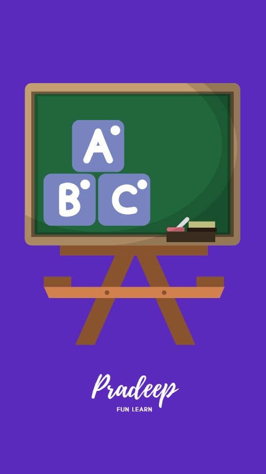

# FunLearn

FunLearn is a play and learn app for kids to create a strong impact on early learning and make it fun.

## Introduction

The aim of this project is to make early learning interactive as possible with reward system and with parents to monitor their child's performance.
This app consist of games and learning platform services along with community chat service.

## Code of Conduct

We have adopted a Code of Conduct that we expect project participants to adhere to. Please read [here](CODEOFCONDUCT.md) so that you can understand what actions will and will not be tolerated.

## Contributing
See [here](CONTRIBUTING.md) for details on how to contribute to this project.
